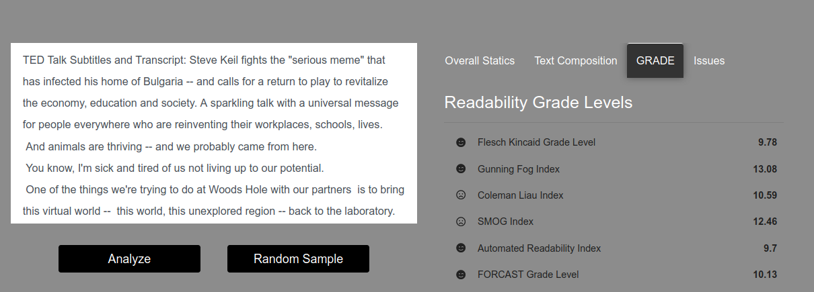

# text_readability_analysis

## Text Readability is a web application that analysis user input for below measurement:

**Motivation:Readability scores are a way to measure whether a written text is likely to be understood by the intended reader. Text that scores a readability grade level of 8 or below will be readable by around 85% of the general public. This can help in improving language skills for language learners, proficiency tests, text simplification, designing of educational materials, etc.**

## Quick Intuition

## Web link

[Text Readability](https://text-readability.herokuapp.com/)
